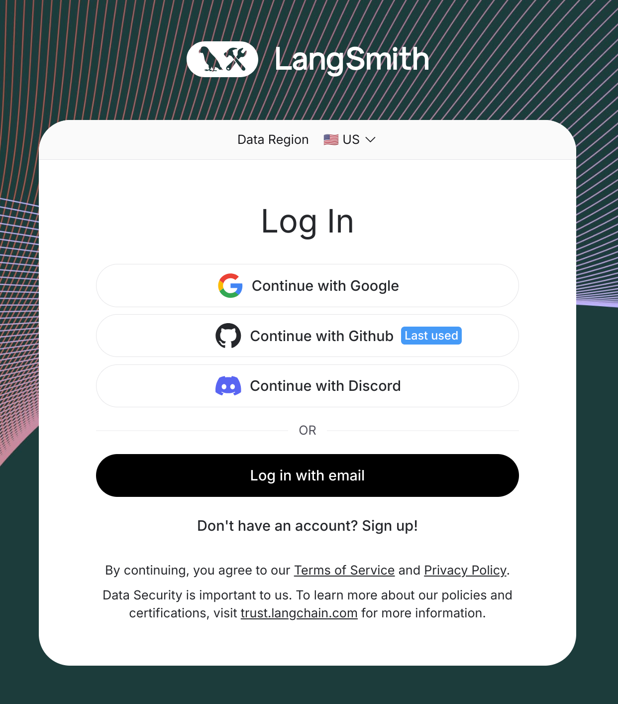
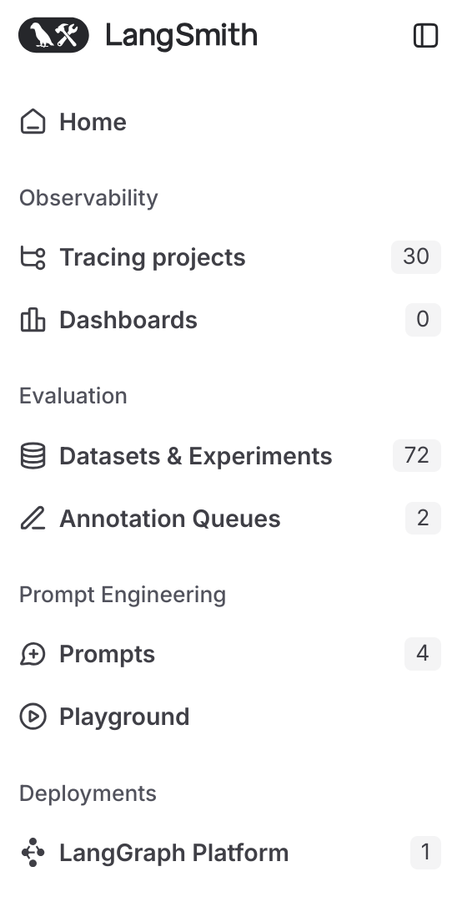
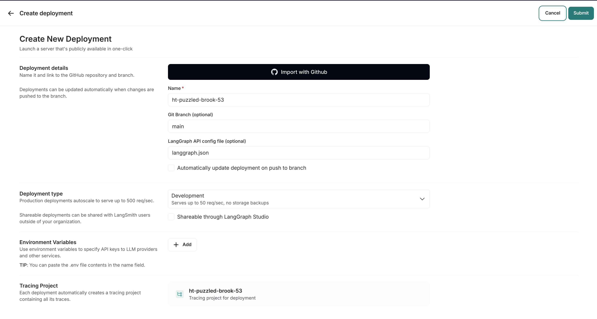
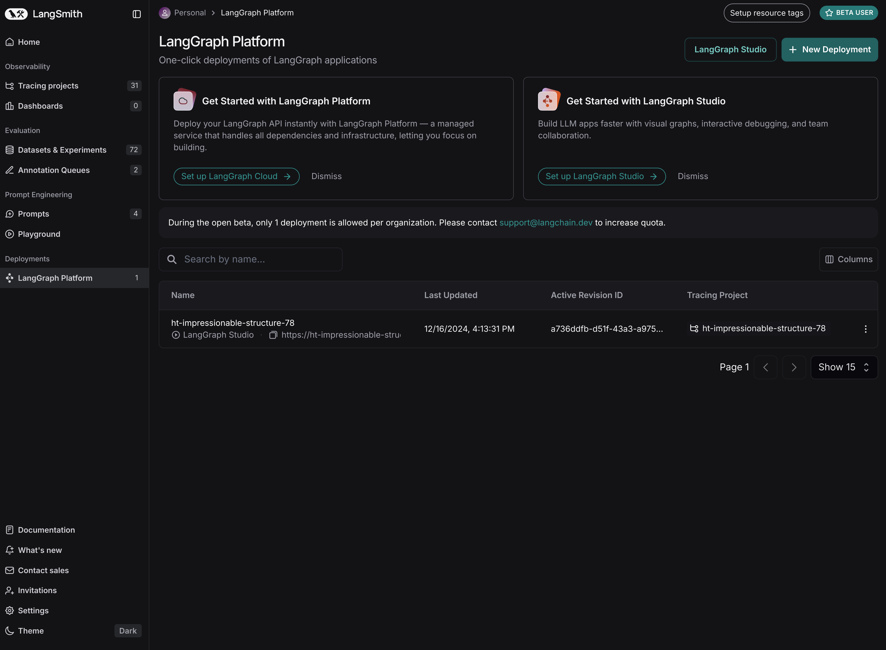
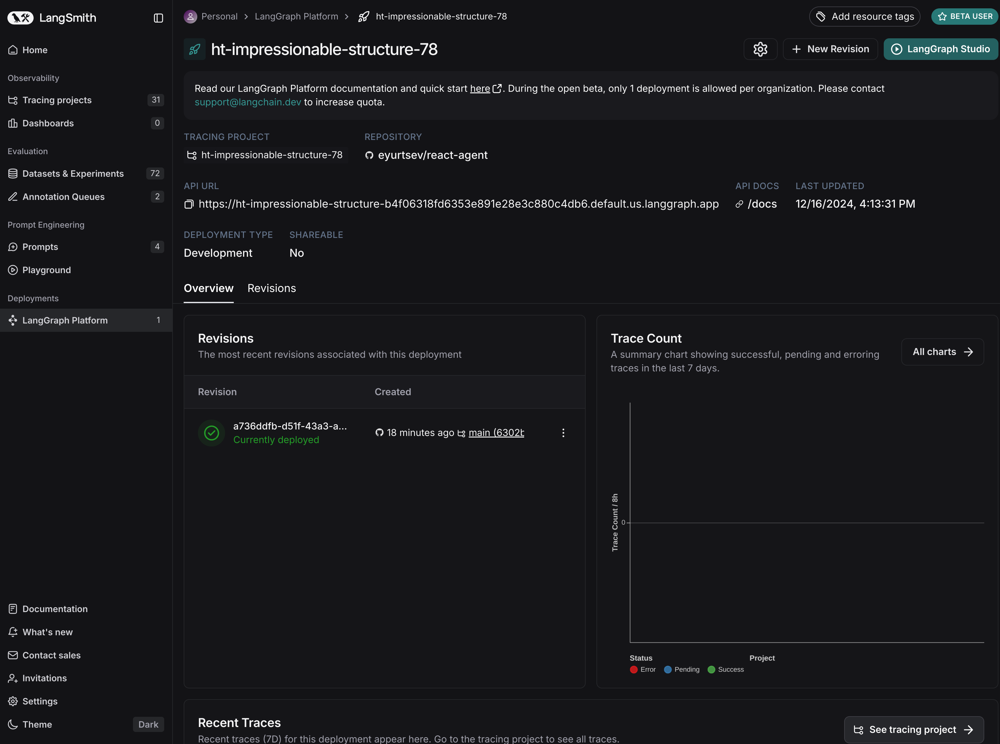
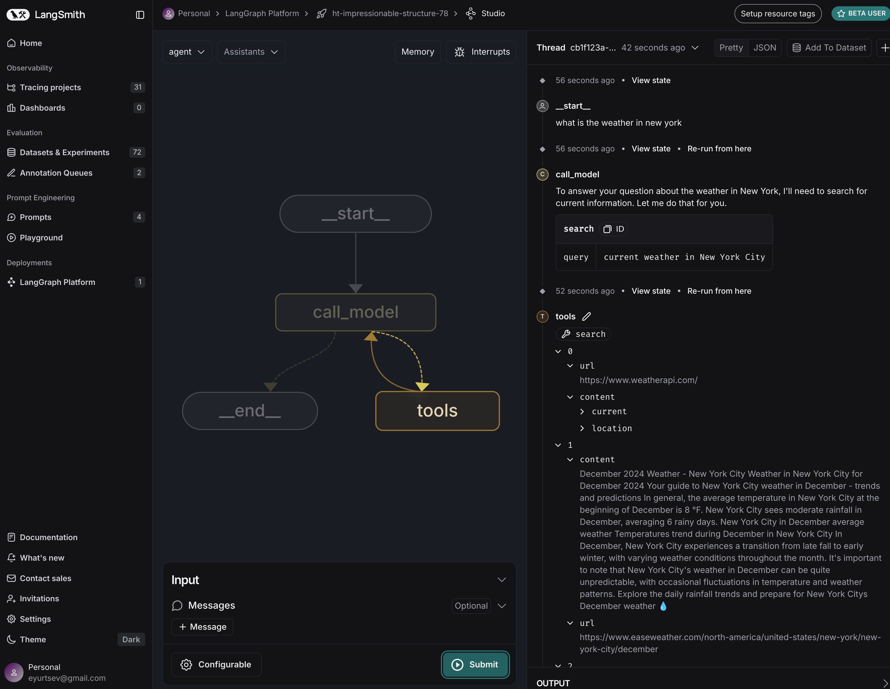

# Quickstart: Deploy on LangGraph Cloud

!!! note "Prerequisites"

    Before you start, make sure you have the following:

    - [A GitHub account](https://github.com/)
    - [A LangSmith account](https://smith.langchain.com/)

In this quickstart, we'll deploy a **pre-built** LangGraph application into LangGraph cloud.

## Create a repository on GitHub

To deploy a LangGraph application to **LangGraph Cloud**, you need to have your application code in a GitHub repository. Either a public or private repository will work.

We will use the pre-built python [**ReAct Agent**](https://github.com/langchain-ai/react-agent) template for this quickstart. This application requires two API keys (`ANTHROPIC_API_KEY` and `TAVILY_API_KEY`) to run. 

1. Go to the [ReAct Agent](https://github.com/langchain-ai/react-agent) repository.
2. Fork the repository to your GitHub account by clicking the `Fork` button in the top right corner.

??? note "Get API Keys for the ReAct Agent template"

    - **ANTHROPIC_API_KEY**: Get an API key from [Anthropic](https://console.anthropic.com/).
    - **TAVILY_API_KEY**: Get an API key on the [Tavily website](https://app.tavily.com/).

## Deploy to LangGraph Cloud

??? note "1. Log in to [LangSmith](https://smith.langchain.com/)"

    <figure markdown="1">
    [{: style="max-height:300px"}](deployment/img/01_login.png)
    <figcaption>
    Go to [LangSmith](https://smith.langchain.com/) and log in. If you don't have an account, you can sign up for free.
    </figcaption>
    </figure>


??? note "2. Click on <em>LangGraph Platform</em> (the left sidebar)"

    <figure markdown="1">
    [{: style="max-height:300px"}](deployment/img/02_langgraph_platform.png)
    <figcaption>
    Select **LangGraph Platform** from the left sidebar.
    </figcaption>
    </figure>

??? note "3. Click on + New Deployment (top right corner)"

    <figure markdown="1">
    [{: style="max-height:300px"}](deployment/img/03_deployments_page.png)
    <figcaption>
    Click on **+ New Deployment** to create a new deployment. This button is located in the top right corner.
    It'll open a new modal where you can fill out the required fields.
    </figcaption>
    </figure>

??? note "4. Click on Import from GitHub (first time users)"

    <figure markdown="1">
    [](deployment/img/04_create_new_deployment.png)
    <figcaption>
    Click on **Import from GitHub** and follow the instructions to connect your GitHub account. This step is needed for **first-time users** or to add private repositories that haven't been connected before.</figcaption>
        </figure>

??? note "5. Select the repository, configure ENV vars etc"

    <figure markdown="1">
    [{: style="max-height:300px"}](deployment/img/05_configure_deployment.png)
    <figcaption>
    Select the <strong>repository</strong>, add env variables and secrets, and set other configuration options.
    </figcaption>
    </figure>

    - **Repository**: Select the repository you forked earlier (or any other repository you want to deploy).
    - Set the secrets and environment variables required by your application. For the **ReAct Agent** template, you need to set the following secrets:
        - **ANTHROPIC_API_KEY**: Get an API key from [Anthropic](https://console.anthropic.com/).
        - **TAVILY_API_KEY**: Get an API key on the [Tavily website](https://app.tavily.com/).

??? note "6. Click Submit to Deploy!"


    <figure markdown="1">
    [{: style="max-height:300px"}](deployment/img/05_configure_deployment.png)
    <figcaption>
        Please note that this step may ~15 minutes to complete. You can check the status of your deployment in the **Deployments** view.
        Click the <strong>Submit</strong> button at the top right corner to deploy your application.
    </figcaption>
    </figure>


## Lagraph Studio Web UI

Once your application is deployed, you can test it in **LangGraph Studio**. 

??? note "1. Click on an existing deployment"

    <figure markdown="1">
    [{: style="max-height:300px"}](deployment/img/07_deployments_page.png)
    <figcaption>
        Click on the deployment you just created to view more details.
    </figcaption>
    </figure>

??? note "2. Click on LangGraph Studio"

    <figure markdown="1">
    [{: style="max-height:300px"}](deployment/img/08_deployment_view.png)
    <figcaption>
        Click on the <strong>LangGraph Studio</strong> button to open LangGraph Studio.
    </figcaption>
    </figure>

<figure markdown="1">
[{: style="max-height:400px"}](deployment/img/09_langgraph_studio.png)
<figcaption>
    Sample graph run in LangGraph Studio.
</figcaption>
</figure>

## Test the API

!!! note

    The API calls below are for the **ReAct Agent** template. If you're deploying a different application, you may need to adjust the API calls accordingly.

Before using, you need to get the URL of your LangGraph deployment. You can find this in the `Deployment` view. Click the URL to copy it to the clipboard.

You also need to make sure you have set up your API key properly, so you can authenticate with LangGraph Cloud.

```shell
export LANGSMITH_API_KEY=...
```

=== "Python SDK (Async)"

    **Install the LangGraph Python SDK**

    ```shell
    pip install langgraph-sdk
    ```

    **Send a message to the assistant (threadless run)**

    ```python
    from langgraph_sdk import get_client

    client = get_client(url="http://localhost:8123")

    async for chunk in client.runs.stream(
        None,  # Threadless run
        "agent", # Name of assistant. Defined in langgraph.json.
        input={
            "messages": [{
                "role": "human",
                "content": "What is LangGraph?",
            }],
        },
        stream_mode="updates",
    ):
        print(f"Receiving new event of type: {chunk.event}...")
        print(chunk.data)
        print("\n\n")
    ```

=== "Python SDK (Sync)"

    **Install the LangGraph Python SDK**

    ```shell
    pip install langgraph-sdk
    ```

    **Send a message to the assistant (threadless run)**

    ```python
    from langgraph_sdk import get_sync_client

    client = get_sync_client(url="http://localhost:8123")

    for chunk in client.runs.stream(
        None,  # Threadless run
        "agent", # Name of assistant. Defined in langgraph.json.
        input={
            "messages": [{
                "role": "human",
                "content": "What is LangGraph?",
            }],
        },
        stream_mode="updates",
    ):
        print(f"Receiving new event of type: {chunk.event}...")
        print(chunk.data)
        print("\n\n")
    ```

=== "Javascript SDK"

    **Install the LangGraph JS SDK**

    ```shell
    npm install @langchain/langgraph-sdk
    ```

    **Send a message to the assistant (threadless run)**

    ```js
    const { Client } = await import("@langchain/langgraph-sdk");

    // only set the apiUrl if you changed the default port when calling langgraph up
    const client = new Client({ apiUrl: "http://localhost:8123"});

    const streamResponse = client.runs.stream(
        null, // Threadless run
        "agent", // Assistant ID
        {
            input: {
                "messages": [
                    { "role": "user", "content": "What is LangGraph?"}
                ]
            },
            streamMode: "messages",
        }
    );

    for await (const chunk of streamResponse) {
        console.log(`Receiving new event of type: ${chunk.event}...`);
        console.log(JSON.stringify(chunk.data));
        console.log("\n\n");
    }
    ```

=== "Rest API"

    ```bash
    curl -s --request POST \
        --url "http://localhost:8123/runs/stream" \
        --header 'Content-Type: application/json' \
        --data "{
            \"assistant_id\": \"agent\",
            \"input\": {
                \"messages\": [
                    {
                        \"role\": \"human\",
                        \"content\": \"What is LangGraph?\"
                    }
                ]
            },
            \"stream_mode\": \"updates\"
        }" 
    ```


## Next Steps

Congratulations! If you've worked your way through this tutorial you are well on your way to becoming a LangGraph Cloud expert. Here are some other resources to check out to help you out on the path to expertise:

### LangGraph Framework

- **[LangGraph Tutorial](../tutorials/introduction.ipynb)**: Get started with LangGraph framework.
- **[LangGraph Concepts](../concepts/index.md)**: Learn the foundational concepts of LangGraph.
- **[LangGraph How-to Guides](../how-tos/index.md)**: Guides for common tasks with LangGraph.
 
### 📚 Learn More about LangGraph Platform

Expand your knowledge with these resources:

- **[LangGraph Platform Concepts](../concepts/index.md#langgraph-platform)**: Understand the foundational concepts of the LangGraph Platform.
- **[LangGraph Platform How-to Guides](../how-tos/index.md#langgraph-platform)**: Discover step-by-step guides to build and deploy applications.
- **[Launch Local LangGraph Server](../tutorials/langgraph-platform/local-server.md)**: This quick start guide shows how to start a LangGraph Server locally for the **ReAct Agent** template. The steps are similar for other templates.


